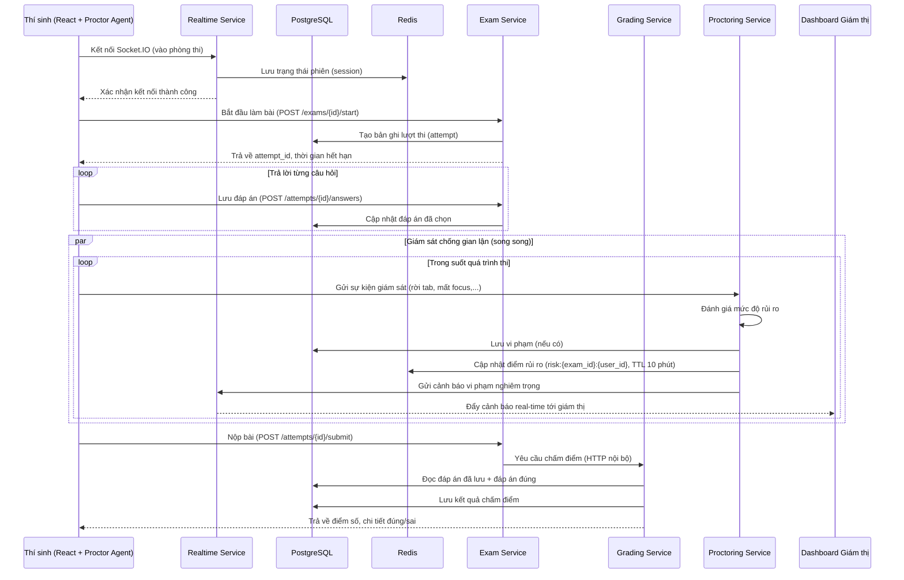

# Sơ đồ luồng real-time lúc thí sinh làm bài

## Ghi chú

- Kết nối real-time (Socket.IO) hiện dùng chủ yếu để **giám thị** (Admin/Teacher dashboard) nhận cảnh báo vi phạm trực tiếp — luồng nộp bài/chấm điểm của **thí sinh** đi qua HTTP thông thường (`exam_service` → `grading_service`), không bắt buộc qua WebSocket.
- Điểm rủi ro (`risk score`) được lưu trong Redis với TTL 10 phút, không phải lưu vĩnh viễn trong PostgreSQL — vi phạm (violation) mới là dữ liệu được lưu bền trong PostgreSQL.
- Xem chi tiết các endpoint liên quan trong Swagger docs của từng service (`http://localhost:800{2,3,4,5}/docs` khi chạy qua Docker).
